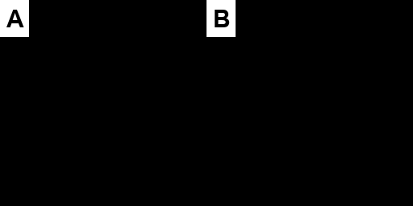
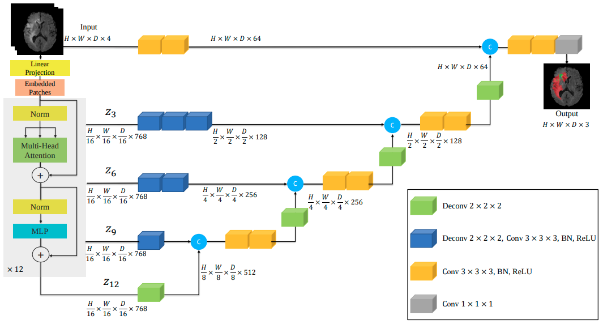

# Brain Tumor Segmentation from MRI with UNETR
The unofficial implementation of [UNETR: Transformers for 3D Medical Image Segmentation](https://arxiv.org/abs/2103.10504) on Pytorch

*Output of my implementation. (A) Ground Truth; (B) Prediction*

## UNETR
- Locality of the receptive fields in convolutional layers still limits their learning capabilities to relatively small regions. Combining self-attention modules with convolutional layers has been proposed to improve the non-local modeling capability.[1]
- UNETR utilizes a contracting-expanding pattern consisting of a stack of transformers as the encoder which is connected to a decoder via skip connections. As commonly used in NLP, the transformers operate on 1D sequence of input embeddings.[1]
## Model Architecture

*UNETR Architecture Figure from Official Paper*

## Dependencies
- Python 3.6+
- `pip install -r requirements.txt`

## Dataset
- BRATS 2016 and 2017[2] datasets were used for training.
- Dataset were downloaded and splitted training/validation automatically by MONAI[3] from Medical Decathlon challenge[4].

## Training
- Training process can be started with following command.
    - `python main.py --mode train --model_path ./path/to/model.pth --dataset_path ./path/to/dataset`
- Dataset will be downloaded to given dataset path if not exist.

## Evaluation
- Trained model will be evaluated after the training process.
- Pretrained model(s) can be evaluated with following command too.
    - `python main.py --mode evaluate --model_path ./path/to/model.pth --dataset_path ./path/to/dataset`

## Inference
- After model is trained, inference can be run for single data with following command.
    - `python main.py --mode inference --model_path ./path/to/model.pth --data_path ./path/to/image`
- Results will be saved to `./results/<data_name>/` for each class (TC/WT/ET).
    
## Other Implementations
- [Original Implentation](https://github.com/Project-MONAI/research-contributions/tree/main/UNETR/BTCV)
- [Self Attention CV / The AI Summer](https://github.com/The-AI-Summer/self-attention-cv)
- [SALMON v.2: Segmentation deep learning ALgorithm based on MONai toolbox](https://github.com/davidiommi/Pytorch--3D-Medical-Images-Segmentation--SALMON)

## References
- [1] [UNETR: Transformers for 3D Medical Image Segmentation](https://arxiv.org/abs/2103.10504)
- [2] [BRATS](https://www.med.upenn.edu/cbica/brats2020/previous.html)
- [3] [MONAI](https://monai.io/)
- [4] [Medical Decathlon](http://medicaldecathlon.com/)
